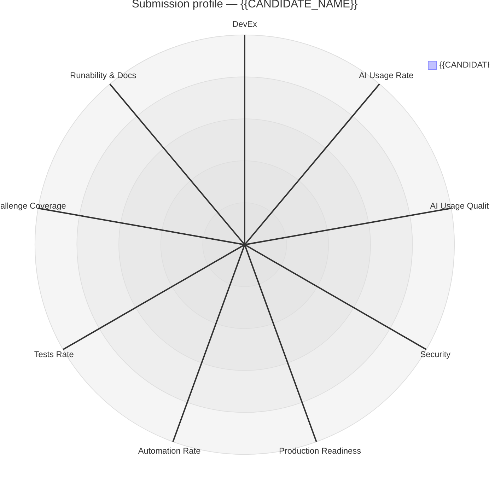

<!-- neo-challenge-review:state
mode: {{MODE}}
runId: {{RUN_ID}}
streams:
  analysis: {{ANALYSIS_STATUS}}
  runability: {{RUNABILITY_STATUS}}
  benchmark: {{BENCHMARK_STATUS}}
finalized: {{FINALIZED}}
-->

# Challenge Review: {{CANDIDATE_NAME}} — {{ROLE}} ({{REVIEW_DATE}})

## 1. Context

<!-- Candidate, role, challenge summary, submission scope, time frame, AI-usage disclosure
found (or not), and the review mode used (analyze: code analysis only, run: + runability,
benchmark: + AI benchmark). -->

## 2. Overall Quality — {{OVERALL_SCORE}}%

<!-- Written summary of the submission (1–3 paragraphs). Reasoned synthesis of the 9 detailed
indicators AFTER the candidate-vs-AI adjustment pass, weighted by the role and the challenge
requirements — not a mechanical average. -->

## 3. Scorecard

| #   | Indicator                  | Raw                               | Adjusted                      | One-line rationale |
|-----|----------------------------|-----------------------------------|-------------------------------|--------------------|
| 1   | DevEx                      | {{DEVEX_RAW_SCORE}}%              | {{DEVEX_SCORE}}%              |                    |
| 2   | AI Usage Rate              | {{AI_RATE_RAW_SCORE}}%            | {{AI_RATE_SCORE}}%            |                    |
| 3   | AI Usage Quality           | {{AI_QUALITY_RAW_SCORE}}%         | {{AI_QUALITY_SCORE}}%         |                    |
| 4   | Security                   | {{SECURITY_RAW_SCORE}}%           | {{SECURITY_SCORE}}%           |                    |
| 5   | Production Readiness       | {{PROD_READINESS_RAW_SCORE}}%     | {{PROD_READINESS_SCORE}}%     |                    |
| 6   | Automation Rate            | {{AUTOMATION_RAW_SCORE}}%         | {{AUTOMATION_SCORE}}%         |                    |
| 7   | Tests Rate                 | {{TESTS_RAW_SCORE}}%              | {{TESTS_SCORE}}%              |                    |
| 8   | Challenge Coverage         | {{CHALLENGE_COVERAGE_RAW_SCORE}}% | {{CHALLENGE_COVERAGE_SCORE}}% |                    |
| 9   | Runability & Docs Accuracy | {{RUNABILITY_RAW_SCORE}}%         | {{RUNABILITY_SCORE}}%         |                    |

## 4. Strengths & Weaknesses Radar

## 5. Strengths & Critical Points

| Strengths | Critical points |
|-----------|-----------------|
| …         | …               |

## 6. Detailed Analysis per Indicator

<!-- One subsection per indicator, each with cited evidence. The Security subsection must cover:
cleartext secrets scan (files + git history), production secrets management in IaC
(reproducibility, storage, initialization), network security, public/private exposure,
encryption at rest/in transit, KMS keys, Terraform state protection. -->

### 6.1 DevEx — {{DEVEX_SCORE}}%

### 6.2 AI Usage Rate — {{AI_RATE_SCORE}}%

<!-- Include the confidence level of the estimate. -->

### 6.3 AI Usage Quality — {{AI_QUALITY_SCORE}}%

### 6.4 Security — {{SECURITY_SCORE}}%

### 6.5 Production Readiness — {{PROD_READINESS_SCORE}}%

### 6.6 Automation Rate — {{AUTOMATION_SCORE}}%

### 6.7 Tests Rate — {{TESTS_SCORE}}%

### 6.8 Challenge Coverage — {{CHALLENGE_COVERAGE_SCORE}}%

<!-- Requirements coverage matrix: -->

| Challenge requirement | Status (covered / partial / missing) | Evidence |
|-----------------------|--------------------------------------|----------|
| …                     | …                                    | …        |

<!-- List every missing or partially covered requirement, and flag unrequested extras. -->

### 6.9 Runability & Docs Accuracy — {{RUNABILITY_SCORE}}%

<!-- Best-effort run log (10 fix attempts max). State precisely how far the run got, and list
every missing step, library, or component in the documentation. -->

Command execution log (chronological — from the runability agent's `command_log`):

| #   | Command | Exit code | Output (relevant excerpt) |
|-----|---------|-----------|---------------------------|
| …   | …       | …         | …                         |

Errors & fixes:

| #   | Error encountered | Fix applied (if any) | Outcome |
|-----|-------------------|----------------------|---------|
| …   | …                 | …                    | …       |

## 7. Candidate Contributions vs AI Contributions

<!-- From the comparison pass against the blind AI baseline implementations (built and tested
in isolated worktrees; list each baseline's output_dir and summarize its execution report,
including notable entries of its command_log — commands, exit codes, results).
Overall similarity: {{SIMILARITY_SCORE}}% (100 = the submission is essentially what a blind AI
produces for this challenge). Cover: what the baselines did, similarity findings, weak AI
signals (comment style, generated-code patterns, script and documentation design), ownership
signals, then the adjustment table below with the orchestrator's arbitration of each delta.
If the comparison pass could not run, say so explicitly — raw scores were kept. -->

| #   | Indicator | Raw | Delta | Adjusted | Reason |
|-----|-----------|-----|-------|----------|--------|
| …   | …         | …   | …     | …        | …      |

## 8. JD Fit

<!-- Alignment between the submission and the JD expectations for {{ROLE}}, seniority
calibration against the CV. -->

## 9. Interview Questions

<!-- Exactly 10 questions, produced by the interview-questions pass, covering across the set:
architecture structure, separation of concerns, infrastructure, security, code, tests. Focused
on the suspicious points (architecture decisions, design patterns, file structure choices) to
reveal whether the candidate masters the submission or is passively driven by the AI. -->

| #   | Topic | Question | Prompted by | Mastered answer vs red flag |
|-----|-------|----------|-------------|-----------------------------|
| …   | …     | …        | …           | …                           |

## 10. Verdict

<!-- Hire signal: Strong yes / Yes / Borderline / No — with the decisive reasons. -->
